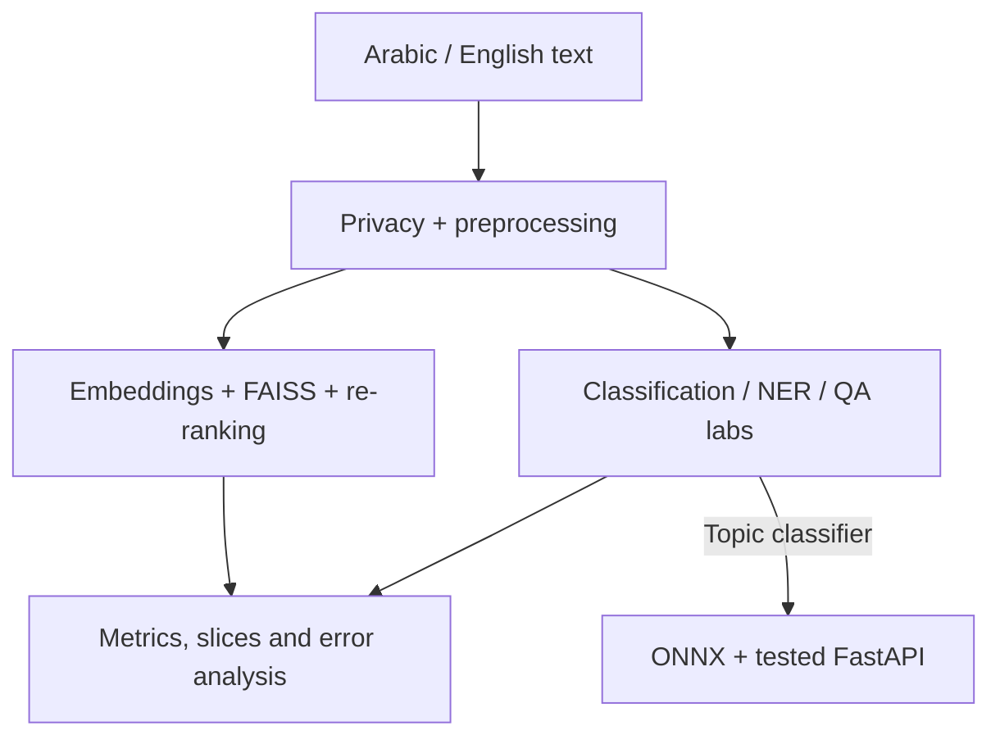

# بيان | Bayan

### Bilingual Applied NLP — Arabic & English
[](https://colab.research.google.com/github/lolo67fa/bayan-nlp-ghalaalshreef-sdaia/blob/main/BayanFullProject_Master.ipynb)
[](https://github.com/SDAIAAcademy)


**Student:** Ghala Ahmad Alshreef
**GitHub:** [@lolo67fa](https://github.com/lolo67fa)  
**Programme:** SDA-AIE-211 — Natural Language Processing with Transformers  
**Evidence reviewed:** 2026-09-01

## Executive summary | الملخص

بيان مشروع تعليمي فردي لاستكشاف معالجة الملاحظات وطلبات الخدمة بالعربية والإنجليزية. يجمع تجهيز النصوص وحماية الخصوصية، وتصنيف الموضوع، والتعرف على الكيانات، والأسئلة والأجوبة الاستخراجية، والبحث الدلالي، ثم التقييم وتجربة تقديم التصنيف عبر FastAPI.

الفكرة هي مساعدة محلل الخدمة على تنظيم النصوص والوصول إلى حالات مشابهة، مع فهم جودة كل مرحلة وحدودها. جميع البيانات المستخدمة في اللابات تعليمية اصطناعية؛ لا تمثل رسائل مستفيدين حقيقيين. المشروع ليس خدمة حكومية رسمية، ولا نظامًا جاهزًا للإنتاج أو لاتخاذ قرارات عالية المخاطر.

**Bayan is an educational Arabic–English NLP project connecting text preparation, task-model experiments, semantic retrieval, evaluation, and a tested classification API. It uses synthetic course data and makes no production-quality claim.**

## Current status | الحالة الحالية

- اللابات `00–08` موجودة، وبها مخرجات تشغيل محفوظة وعلامات نجاح Core.
- [الدفتر الرئيسي](BayanFullProject_Master.ipynb) يجمع اللابات ومراحل الربط، ويحتوي على تشغيل محفوظ لـ137 خلية كود دون مخرجات خطأ، مع `BAYAN_ALL_LABS_MASTER=PASS`.
- آخر فحص مستقل للاختبارات بتاريخ 2026-09-01: **79 passed**. نجاح اختبارات الوحدات لا يثبت اجتياز جميع متطلبات المشروع أو جودة النماذج.
- توجد نتائج benchmark وتجربة خدمة محفوظة، لكن القياس الرسمي النهائي والتوثيق المصاحب لم يكتملَا بعد.
- الإصدار النهائي المخطط: `submission-v1.0`؛ لم يُنشر هذا الوسم وقت مراجعة الأدلة.

## What Bayan does | مكونات المشروع

| المكوّن | التطبيق والدليل الحالي |
|---|---|
| Privacy & preprocessing | فصل `display_text` عن `model_text`، واختبار إخفاء أنماط بريد إلكتروني وجوال سعودي اصطناعية. |
| Tokenization & attention | قياس fertility وtruncation، وتنفيذ scaled dot-product attention والقناع وتقسيم الرؤوس. |
| Topic classification | مقارنة TF-IDF + LinearSVC مع fine-tuning لـmultilingual DistilBERT. |
| Sentiment classification | جزء من نطاق المشروع المطلوب؛ البيانات تتضمن sentiment، لكن لا توجد بعد نتائج محفوظة لرأس مشاعر مستقل. |
| Named entity recognition | محاذاة BIO مع subwords وتدريب تجريبي، مع تقييم صارم على مستوى الكيان. |
| Extractive QA | استخراج span مع offsets وحدود لطول الإجابة ودعم no-answer. |
| Arabic NLP | ملفات معالجة عربية بإصدارات، وفحوص golden tests، وتجارب MSA/Gulf/Arabizi. |
| Semantic search | embeddings متعددة اللغات، وفهرس FAISS، وعتبة no-answer، وتجربة cross-encoder re-ranking. |
| Evaluation & serving | confidence intervals وslices وتحليل أخطاء، ومقارنة PyTorch/ONNX/INT8، واختبارات FastAPI. |

## Architecture | ترابط المراحل



هذا مخطط مراحل العمل في اللابات. واجهة API الحالية تقدم **تصنيف الموضوع**؛ لا تدعي أن NER وQA والبحث والمشاعر كلها متاحة كمسارات HTTP.

## Run on Google Colab | التشغيل

### 1. Open the master notebook

[**افتحي مشروع بيان الكامل في Google Colab**](https://colab.research.google.com/github/lolo67fa/bayan-nlp-ghalaalshreef-sdaia/blob/main/BayanFullProject_Master.ipynb)

1. احفظي نسخة في Drive لتحتفظي بتعديلاتك ومخرجاتك.
2. استخدمي GPU مثل T4 لأجزاء fine-tuning إن توفر؛ قياسات ONNX المسجلة أدناه أجريت على CPU.
3. شغلي خلايا الإعداد ثم الخلايا بالترتيب. كل لاب يثبت نسخ المكتبات التي يعتمد عليها؛ اتصال الإنترنت مطلوب لتنزيل المكتبات والنماذج.
4. الوضع الافتراضي في الملف الرئيسي هو `MASTER_PROJECT_MODE = False`. هذا يشغّل Lab 8 بوضع `SYSTEMS_SMOKE` للتحقق من آلية التصدير والخدمة، وليس لإثبات أداء النموذج النهائي.
5. بعد أي تعديل، أعيدي تشغيل الجلسة ثم `Run all` واحفظي المخرجات. قد تختلف الأزمنة بين جلسات Colab.

### 2. Reproduce the project-model benchmark

في إعدادات الملف الرئيسي، يتطلب `MASTER_PROJECT_MODE = True` مسارات متاحة لنموذج التصنيف المدرَّب، والـtokenizer، وملف validation:

```python
MASTER_PROJECT_MODE = True
MASTER_PROJECT_MODEL_SOURCE = "/content/drive/MyDrive/bayan/model-v1"
MASTER_PROJECT_TOKENIZER_SOURCE = "/content/drive/MyDrive/bayan/model-v1"
MASTER_PROJECT_VALIDATION_CSV = "/content/drive/MyDrive/bayan/validation.csv"
```

هذه المسارات أمثلة الإعداد المسجل، وليست ملفات عامة مضمّنة في GitHub. يجب ربط Drive وتوفير الملفات أو تعديل المسارات قبل تشغيل هذا الوضع. تغيير العلم إلى `True` وحده لا ينشئ النموذج ولا البيانات.

يحتاج ملف validation إلى الأعمدة `example_id,split,language,text,label`. تُختار إعدادات النموذج والتحسين على validation، وتُثبت القرارات قبل التقييم النهائي على frozen test. تبقى أوزان النماذج وملفات ONNX خارج GitHub.

مصدر القياس المحفوظ للنموذج الحقيقي هو [Notebook 08](notebooks/08_optimization_serving.ipynb) و[benchmark_results.json](reports/benchmark_results.json). تشغيل Lab 8 المحفوظ داخل الملف الرئيسي ما زال `SYSTEMS_SMOKE`؛ الملخص الذي يعرض قياس النموذج الحقيقي يحيل إلى أدلة Notebook 08، ولا يعيد قياسها بمجرد طباعتها.

### 3. Individual labs | روابط اللابات

تبقى الدفاتر المنفصلة أدلة مستقلة؛ الملف الرئيسي لا يستبدلها في التسليم.

| # | Notebook | الغرض | Colab |
|---:|---|---|---|
| 00 | [Runtime Doctor](notebooks/00_runtime_doctor.ipynb) | فحص البيئة | [Open](https://colab.research.google.com/github/lolo67fa/bayan-nlp-ghalaalshreef-sdaia/blob/main/notebooks/00_runtime_doctor.ipynb) |
| 01 | [Text Processing & Tokenization](notebooks/01_text_processing_tokenization.ipynb) | تجهيز النصوص والـtokenizer | [Open](https://colab.research.google.com/github/lolo67fa/bayan-nlp-ghalaalshreef-sdaia/blob/main/notebooks/01_text_processing_tokenization.ipynb) |
| 02 | [Attention & Transformers](notebooks/02_attention_transformers.ipynb) | الانتباه والقناع والرؤوس | [Open](https://colab.research.google.com/github/lolo67fa/bayan-nlp-ghalaalshreef-sdaia/blob/main/notebooks/02_attention_transformers.ipynb) |
| 03 | [Text Classification](notebooks/03_text_classification.ipynb) | baseline وfine-tuning | [Open](https://colab.research.google.com/github/lolo67fa/bayan-nlp-ghalaalshreef-sdaia/blob/main/notebooks/03_text_classification.ipynb) |
| 04 | [NER & QA](notebooks/04_ner_and_qa.ipynb) | الكيانات والإجابات الاستخراجية | [Open](https://colab.research.google.com/github/lolo67fa/bayan-nlp-ghalaalshreef-sdaia/blob/main/notebooks/04_ner_and_qa.ipynb) |
| 05 | [Arabic NLP](notebooks/05_arabic_nlp.ipynb) | معالجة العربية واختباراتها | [Open](https://colab.research.google.com/github/lolo67fa/bayan-nlp-ghalaalshreef-sdaia/blob/main/notebooks/05_arabic_nlp.ipynb) |
| 06 | [Semantic Search](notebooks/06_semantic_search.ipynb) | FAISS والاسترجاع وإعادة الترتيب | [Open](https://colab.research.google.com/github/lolo67fa/bayan-nlp-ghalaalshreef-sdaia/blob/main/notebooks/06_semantic_search.ipynb) |
| 07 | [Evaluation & Error Analysis](notebooks/07_evaluation_error_analysis.ipynb) | المقاييس وفترات الثقة والأخطاء | [Open](https://colab.research.google.com/github/lolo67fa/bayan-nlp-ghalaalshreef-sdaia/blob/main/notebooks/07_evaluation_error_analysis.ipynb) |
| 08 | [Optimization & Serving](notebooks/08_optimization_serving.ipynb) | ONNX وFastAPI وbenchmark | [Open](https://colab.research.google.com/github/lolo67fa/bayan-nlp-ghalaalshreef-sdaia/blob/main/notebooks/08_optimization_serving.ipynb) |

ملفات الإصدارات المثبتة: [Day 1](requirements-day1.txt)، [Day 2](requirements-day2.txt)، [Day 3](requirements-day3.txt)، [Day 4](requirements-day4.txt). تعتمد هذه الملفات على بيئة Colab التي توفر NumPy وPyTorch؛ ليست قائمة تثبيت مكتملة لأي جهاز محلي.

## Results | النتائج المسجلة

| وسم النتيجة | المعنى |
|---|---|
| `MEASURED_SMOKE` | تجربة مقاسة على عينة تعليمية صغيرة؛ ليست دليلًا على الأداء الإنتاجي. |
| `COURSE_FIXTURE` | بيانات أو تنبؤات جاهزة من الدورة لتعليم طريقة التقييم؛ ليست تنبؤات نموذج المشروع. |
| `SYSTEMS_SMOKE` | تحقق من آلية التصدير والخدمة؛ لا يثبت جودة المهمة. |
| `MEASURED` / `PROJECT_ARTIFACT` | قياس محفوظ لنسخة نموذج المشروع على workload محدد؛ لا يعني تلقائيًا اجتياز شروط القياس الرسمي. |

| Component | النتيجة | العينة / نوع الدليل | المصدر |
|---|---|---|---|
| Topic — baseline | Validation macro-F1: **0.6667** | classification sample، `MEASURED_SMOKE` | [Notebook 03](notebooks/03_text_classification.ipynb) |
| Topic — Transformer | Validation macro-F1: **0.55**؛ الفرق **−0.1167** | نفس validation؛ لم يتجاوز baseline | [Notebook 03](notebooks/03_text_classification.ipynb) |
| Sentiment | لا توجد نتيجة محفوظة لرأس مستقل حتى هذه المراجعة | غير مقاس | [عقد المهام في Notebook 03](notebooks/03_text_classification.ipynb) |
| NER | Entity F1: **0.0**؛ 0 كيانات متنبأ بها مقابل 4 حقيقية | `MEASURED_SMOKE` | [Notebook 04](notebooks/04_ner_and_qa.ipynb) |
| QA | اختبارات span وno-answer محفوظة؛ لا يُدّعى اجتياز 17/20 | العينة 10 أسئلة، منها حالتا no-answer | [Notebook 04](notebooks/04_ner_and_qa.ipynb) |
| Search | Recall@3: **1.0**؛ MRR@3: **0.6667** | 6 استعلامات اختبار قابلة للإجابة، `MEASURED_SMOKE` | [Retrieval metrics](reports/retrieval_metrics.json) |
| Evaluation method | Fixture A: **0.7807**، Fixture B: **0.7819** مع bootstrap CIs | 36 تنبؤًا، `COURSE_FIXTURE` | [Evaluation fixture](reports/day3_evaluation_fixture.json) |
| API contract | health/ar/en: **200**؛ invalid inputs: **422**؛ canaries: **2 PASS** | فحص وظيفي بـTestClient، لا اختبار ضغط HTTP | [Service smoke](reports/service_smoke.json) |

الـTransformer لم يتفوق على baseline في القياس المسجل، وNER لم يحقق جودة كافية. لا تُستبدل النتائج الضعيفة بنتائج مرجعية، ولا يُفسّر انخفاض training loss وحده على أنه نجاح للمهمة.

### Optimization benchmark | مقارنة التشغيل

المصدر: [benchmark_results.json](reports/benchmark_results.json). القياس على CPU، و8 صفوف عربي/إنجليزي تُعالج في كل تكرار بدفعات حجمها 4، مع warm-up عدد 5 وتكرار عدد 30. الأزمنة التالية تخص **model-only**؛ الجودة هي macro-F1 على validation المستخدمة.

| Runtime | p95 (ms) | p99 (ms) | Macro-F1 | Quality tax | القرار المسجل |
|---|---:|---:|---:|---:|---|
| PyTorch FP32 | 1107.054 | 1168.868 | 0.55 | 0 | Baseline |
| ONNX FP32 | 137.120 | 160.226 | 0.55 | 0 | `ADOPT_ONNX_FP32` |
| ONNX dynamic INT8 | 85.410 | 89.315 | 0.325 | 0.225 | غير مختار؛ تجاوز ميزانية تراجع الجودة |

أظهر ONNX FP32 تسريعًا مقاسًا عند p95 بنحو **8.07×** مع اتفاق التنبؤات بنسبة 100% في هذه العينة. لا تمثل هذه التجربة اختبار HTTP عند 16 طلبًا متزامنًا، ولا تثبت تحقيق حد p99 الرسمي البالغ 40 ms. يبقى استكمال [BENCHMARKS.md](BENCHMARKS.md) والقياس الرسمي مطلوبًا.

## Measured extension | تجربة إعادة الترتيب

الامتداد المجرّب هو cross-encoder re-ranking باستخدام `cross-encoder/mmarco-mMiniLMv2-L12-H384-v1`.

- Baseline MRR@3: **0.6667**.
- After re-ranking: **0.7222**؛ تحسن مقاس قدره **0.0556**.
- Median re-ranking latency: **15.70 ms**؛ p95: **17.16 ms**، مع استبعاد warm-up.
- القرار في [التقرير العددي](reports/retrieval_metrics.json): `ADOPT_FOR_EXPERIMENT`.
- النطاق: ستة استعلامات فقط؛ الدليل `MEASURED_SMOKE`، وليس اعتمادًا إنتاجيًا أو إثباتًا لاجتياز المتطلب الرسمي.


## API example | تجربة الخدمة

بعد تشغيل خلايا بناء التطبيق في Notebook 08، يمكن تجربة المسارات داخل نفس الجلسة دون نشر خادم عام:

```python
from fastapi.testclient import TestClient

with TestClient(app) as client:
    print(client.get("/health").json())
    for payload in [
        {"text": "أحتاج معرفة حالة طلب التصريح", "language": "ar"},
        {"text": "The bus did not arrive on time", "language": "en"},
    ]:
        response = client.post("/v1/classify", json=payload)
        print(response.status_code, response.json())
```

تتضمن الاستجابة `request_id` و`language` و`prediction` و`latency_ms` وبيانات إصدار النموذج والمعالجة. تعتمد الفئة والثقة على النموذج الفعلي، ولا يضمن المثال تنبؤًا صحيحًا. يرفض التطبيق النص الفارغ واللغة غير المدعومة. التطبيق التعليمي ليس خدمة إنتاجية موثّقة أو مؤمّنة للنشر العام.

## Error analysis and limits | الأخطاء والحدود

- من الأخطاء المعروفة: تقسيم الجملة بعد الاختصار العربي `د.`؛ قد يؤثر ذلك في أي معالجة تعتمد على تقسيم الجمل.
- [تصنيف الأخطاء المحفوظ](reports/day3_error_taxonomy.csv) يغطي 8 من 8 أخطاء في `prediction_b` (36 صفًا، معدل خطأ 22%) — تغطية كاملة. المتطلب `≤100 خطأ` سقف لا أرضية؛ لا تُنشأ أخطاء ولا تُكرر أمثلة لزيادة العدد.
- - الإصلاحات المرتبة في التقرير الحالي: معالجة النصوص الطويلة، وتحسين تغطية اللهجة الخليجية، وتحسين ترتيب نتائج البحث العربي. تحليل الشرائح المستخدم لتعليم هذه الطريقة مبني على `COURSE_FIXTURE`، ويجب إعادة اشتقاق الأولويات من تنبؤات المشروع الفعلية.
- البيانات صغيرة واصطناعية، والشرائح العربية والإنجليزية واللهجية لا تمثل جميع المستخدمين. تُعرض الشرائح الصغيرة كـ`SMALL_SLICE`.
- ملفات المعالجة العربية يجب أن تتطابق بين train/eval/serve. إخفاء البريد والجوال هنا محدود وتعليمي، وليس نظامًا شاملًا لاكتشاف البيانات الشخصية.
- لا توجد نتائج نهائية تثبت تحسن التصنيف الرسمي، أو NER F1 المطلوب، أو no-answer على 20 حالة، أو Recall@10/MRR@10، أو نسب Invariance/MFT، أو حمل HTTP الرسمي.
- يلزم فحص بشري وتقييم أوسع للخصوصية والجودة قبل أي استخدام فعلي. بيانات الأشخاص الحقيقية والمفاتيح والأوزان الكبيرة لا تُرفع إلى الريبو.

## Repository guide | الملفات والأدلة

| المسار | المحتوى |
|---|---|
| [BayanFullProject_Master.ipynb](BayanFullProject_Master.ipynb) | العرض المترابط لجميع اللابات |
| [notebooks/](notebooks/) | الدفاتر الأصلية المنفصلة `00–08` |
| [src/bayan/](src/bayan/) | وحدات المعالجة والانتباه والمقاييس والبحث وعقود الخدمة والمدقق |
| [tests/](tests/) | اختبارات الوحدات والعقود |
| [data/sample/](data/sample/) | عينات الدورة الاصطناعية |
| [reports/](reports/) | المقاييس والـmanifest وتحليل الأخطاء ونتائج الخدمة |
| [DATA_CARD.md](DATA_CARD.md) / [data/DATA_CARD.md](data/DATA_CARD.md) | بطاقة المشروع وبطاقة العينات التعليمية؛ بطاقة الجذر تحتاج إكمالًا |
| [MODEL_CARD.md](MODEL_CARD.md) | بطاقة النموذج؛ تحتاج إكمالًا |
| [EVALUATION_REPORT.md](EVALUATION_REPORT.md) | تقرير التقييم؛ يحتاج تحديث أدلة اليوم الرابع واتساق القرارات |
| [BENCHMARKS.md](BENCHMARKS.md) | تقرير الأداء النهائي؛ يحتاج استكمالًا من الأدلة المسجلة |
| [DECISIONS.md](DECISIONS.md) / [PROGRESS.md](PROGRESS.md) | القرارات وحالة مراحل المشروع |
| [PROJECT_SUMMARY.json](PROJECT_SUMMARY.json) / [SUBMISSION.yml](SUBMISSION.yml) | الملخص وعقد التسليم |
| `STUDENT_PROFILE.md` | الاسم الإلزامي للبروفايل؛ النسخة المرفوعة وقت المراجعة اسمها `STUDENT_PROFILE (4).md` ويجب إعادة تسميتها |

## Validation and final submission | التحقق والتسليم

لتشغيل اختبارات الوحدات الخفيفة من Terminal أو داخل بيئة Linux/Colab، بعد توفر Git وPython. في Colab أضيفي `%%bash` في أول خلية الأوامر التالية:

```bash
git clone https://github.com/lolo67fa/bayan-nlp-ghalaalshreef-sdaia.git
cd bayan-nlp-ghalaalshreef-sdaia
python -m pip install numpy pytest
PYTHONPATH=src python -m pytest -q
PYTHONPATH=src python scripts/validate_submission.py .
```

هذه الأوامر لا تعيد تدريب النماذج أو تشغيل جميع اللابات؛ لذلك تُستخدم خلايا إعداد الدفاتر لإعادة إنتاج تجارب ML. لا يلزم تنزيل أوزان النماذج لتشغيل اختبارات الوحدات المذكورة.

**حالة المدقق:** يجتاز الريبو `scripts/validate_submission.py` بنتيجة `BAYAN_SUBMISSION_VALIDATOR=PASS` على جميع الفحوص الخمسة: هيكل المشروع، والدفاتر التسعة وعلامات Core، وعقد `PROJECT_SUMMARY.json`، وعقد `SUBMISSION.yml`، وخلو المستودع من الملفات الممنوعة أو الكبيرة. يبقى تحذيران: التشغيل بـ`--require-tag` بعد إنشاء الوسم، وفحص الروابط من نافذة خاصة — وكلاهما يُنفّذ في خطوة التسليم النهائية. لا توجد GitHub Actions workflow مسجلة؛ لذلك لا يُعرض شعار CI.
قبل إنشاء النسخة النهائية:

1. إعادة تسمية البروفايل إلى `STUDENT_PROFILE.md` وإكمال بطاقات البيانات والنموذج والأداء وملخص المشروع.
2. توثيق التقييم الرسمي والامتداد المقاس، وتوحيد نتائج وقرارات التقارير. لا تعني علامات نجاح اللابات تحقق عتبات التقييم النهائي.
3. تحديث `PROGRESS.md` و`DECISIONS.md` و`EVALUATION_REPORT.md` بروابط الأدلة الصحيحة، والتحقق من الخصوصية والاختبارات قبل اعتماد بيانات `PROJECT_SUMMARY.json`.
4. تشغيل المدقق، ثم حفظ commit النهائي وإنشاء الوسم `submission-v1.0` عليه.
5. بعد إنشاء الوسم محليًا، تشغيل:

```bash
PYTHONPATH=src python scripts/validate_submission.py . --require-tag
```

6. اختبار روابط GitHub وColab من نافذة خاصة، وتجهيز عرض مدته 5 دقائق يتضمن مثالًا عربيًا وإنجليزيًا ونتيجة موثوقة وحدًا معروفًا وقرار التحسين.

نجاح المدقق لا يمنح بذاته اعتمادًا رسميًا أو يثبت تحقيق جميع عتبات المشروع. يُضاف رابط الإصدار النهائي بعد نشره، ولا يُنسب نجاح تسليم قبل وجود دليله.

## Sources, licences and acknowledgements | المصادر والشكر

نُفذ هذا المشروع ضمن برنامج **SDA-AIE-211 — Natural Language Processing with Transformers**، بإعداد وتقديم المدربة **ميعاد المري**، ضمن برامج **أكاديمية سدايا**.

- [SDAIA Academy](https://github.com/SDAIAAcademy).
- [Bayan Applied NLP Course — materials and starter notebooks](https://github.com/almiyead-rgb/bayan-applied-nlp-course).
- [Multilingual DistilBERT](https://huggingface.co/distilbert/distilbert-base-multilingual-cased)، و[mBERT](https://huggingface.co/google-bert/bert-base-multilingual-cased)، و[CAMeLBERT-DA](https://huggingface.co/CAMeL-Lab/bert-base-arabic-camelbert-da).
- [Multilingual MiniLM embeddings](https://huggingface.co/sentence-transformers/paraphrase-multilingual-MiniLM-L12-v2)، و[mMARCO multilingual re-ranker](https://huggingface.co/cross-encoder/mmarco-mMiniLMv2-L12-H384-v1).
- المكتبات: [NumPy](https://numpy.org/)، [PyTorch](https://pytorch.org/)، [Transformers](https://github.com/huggingface/transformers)، [scikit-learn](https://github.com/scikit-learn/scikit-learn)، [spaCy](https://github.com/explosion/spaCy)، [CAMeL Tools](https://github.com/CAMeL-Lab/camel_tools)، [Sentence Transformers](https://github.com/huggingface/sentence-transformers)، [FAISS](https://github.com/facebookresearch/faiss)، [ONNX Runtime](https://github.com/microsoft/onnxruntime)، و[FastAPI](https://github.com/fastapi/fastapi).

اعتمد المشروع على مواد ودفاتر الدورة، مع الاستعانة بأدوات ذكاء اصطناعي في تطوير وتنظيم بعض الأجزاء وشرحها وتصحيح الأخطاء. تبقى مراجعة الكود والقرارات وتوثيق نتائج التشغيل مسؤولية صاحبة المشروع.

لم يُضف ترخيص مستقل لكود هذا المستودع حتى هذه المراجعة؛ لا يُدّعى ترخيص MIT أو ملكية مواد الدورة أو النماذج أو البيانات أو العلامات المؤسسية. تبقى شروط كل مصدر ووزن ومكتبة كما يحددها صاحبها، ويجب استكمال معلومات المصدر والترخيص في بطاقات المشروع قبل إعادة الاستخدام أو التوزيع.

> This is an educational student project. It is not an official SDAIA product and does not imply institutional endorsement. The badge identifies the training programme, not a certification of project completion.
