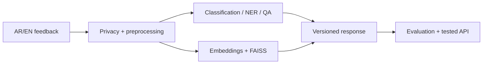

# Bayan — Bilingual Applied NLP Project

**Student:** FILL_ME  
**GitHub:** FILL_ME  
**Final release:** FILL_ME

## Executive summary | الملخص

FILL_ME: فقرة قصيرة تشرح المشكلة والمستخدم والنتيجة والحدود. اذكر صراحة أن البيانات تعليمية اصطناعية/عامة وليست بيانات مستفيدين حقيقية.

## What Bayan does | ماذا يفعل بيان؟

1. FILL_ME: privacy/preprocessing.
2. FILL_ME: topic and sentiment classification.
3. FILL_ME: NER.
4. FILL_ME: extractive QA/no-answer.
5. FILL_ME: bilingual semantic search.
6. FILL_ME: evaluation and serving.

## Scope and non-goals | النطاق وما لا يدعيه المشروع

- In scope: FILL_ME
- Out of scope: FILL_ME
- Not for: production/government decisions without further validation — FILL_ME

## Reproduce on Google Colab Free

| # | Notebook | Colab | Purpose |
|---:|---|---|---|
| 00 | runtime doctor | FILL_ME | environment |
| 01 | text processing/tokenisation | FILL_ME | Gate A |
| 02 | attention/transformers | FILL_ME | LO2 |
| 03 | classification | FILL_ME | Gate B |
| 04 | NER and QA | FILL_ME | Gate B |
| 05 | Arabic NLP | FILL_ME | Gate C |
| 06 | semantic search | FILL_ME | Gate C |
| 07 | evaluation/error analysis | FILL_ME | Gate C |
| 08 | optimisation/serving | FILL_ME | Gate D |

Clean-run instructions:

1. Open notebook 00 and choose **Save a copy in Drive**.
2. Run in numeric order using Colab Free.
3. Use **Runtime → Restart session and run all** before final evidence.
4. Do not place tokens, PII, model weights, or private Drive links in the repository.

## Architecture



## Results | النتائج

كل رقم يحمل `MEASURED`, `MEASURED_SMOKE`, `SYSTEMS_SMOKE`, `TARGET`, أو `REFERENCE`.

| Component | Metric | Result + label | Split/workload | Evidence |
|---|---|---:|---|---|
| topic classification | Macro-F1 | FILL_ME | FILL_ME | FILL_ME |
| sentiment classification | Macro-F1 | FILL_ME | FILL_ME | FILL_ME |
| NER | entity F1 | FILL_ME | FILL_ME | FILL_ME |
| QA | EM/F1/no-answer | FILL_ME | FILL_ME | FILL_ME |
| search | Recall@k/MRR | FILL_ME | FILL_ME | FILL_ME |
| serving | p95/throughput/quality tax | FILL_ME | FILL_ME | `BENCHMARKS.md` |

## Error found and decision | خطأ وقرار

- Observed failure: FILL_ME
- Slice/taxonomy: FILL_ME
- Fix or deferred action: FILL_ME
- Evidence after change: FILL_ME

## Measured extension | الامتداد المقاس

- Extension chosen: FILL_ME
- Baseline: FILL_ME
- Benefit/cost metric: FILL_ME
- Evidence path: FILL_ME
- Decision and limitation: FILL_ME

## Repository evidence

- `DATA_CARD.md`
- `MODEL_CARD.md`
- `EVALUATION_REPORT.md`
- `BENCHMARKS.md`
- `DECISIONS.md`
- `PROGRESS.md`
- `PROJECT_SUMMARY.json`
- `SUBMISSION.yml`

## Limitations and responsible use

- Data limitation: FILL_ME
- Arabic/dialect/Arabizi limitation: FILL_ME
- Task/model limitation: FILL_ME
- Evaluation uncertainty: FILL_ME
- Serving/security limitation: FILL_ME
- Human review requirement: FILL_ME

## Final validation

```bash
PYTHONPATH=src python scripts/validate_submission.py . --require-tag
```

- Validator status: FILL_ME
- CI badge/link: FILL_ME
- Release `submission-v1.0`: FILL_ME

## License and acknowledgements

FILL_ME: project code license, dataset/model/library licenses, and source links. Do not imply ownership of third-party models, libraries, or institutional marks.
